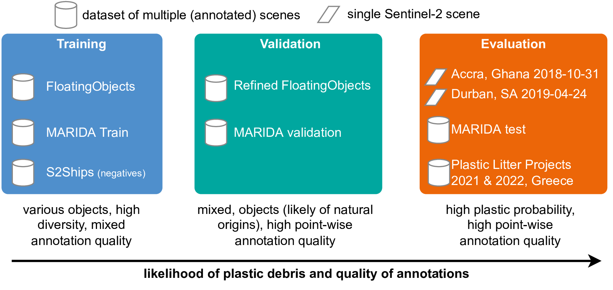

# Datasets

We train on a combination of several datasets. If you execute the training script with the `--download` parameter, all 
necessary datasets should be downloaded automatically

## MARIDA

we re-downloaded the Scenes from Google Earth Engine in the `scenes` subfolder

please cite the original MARIDA paper: https://github.com/marine-debris/marine-debris.github.io

> Kikaki K, Kakogeorgiou I, Mikeli P, Raitsos DE, Karantzalos K (2022) MARIDA: A benchmark for Marine Debris detection from Sentinel-2 remote sensing data. PLoS ONE 17(1): e0262247. https://doi.org/10.1371/journal.pone.0262247

download the original MARIDA data from here: https://doi.org/10.5281/zenodo.5151941

We added Sen2Cor corrected Sentinel-2 scenes in [this](https://marinedebrisdetector.s3.eu-central-1.amazonaws.com/data/MARIDA.zip) modified dataset (21GB compressed; 24GB unzipped).

## FloatingObjects

dataset available here https://github.com/ESA-PhiLab/floatingobjects
this link: https://drive.google.com/drive/folders/1QGjzRTVRQbf4YbzfUWMeIdJvYkzuipGJ?usp=sharing

please cite the authors for this dataset
> Mifdal, J., Longépé, N., and Rußwurm, M.: TOWARDS DETECTING FLOATING OBJECTS ON A GLOBAL SCALE WITH LEARNED SPATIAL FEATURES USING SENTINEL 2, ISPRS Ann. Photogramm. Remote Sens. Spatial Inf. Sci., V-3-2021, 285–293, https://doi.org/10.5194/isprs-annals-V-3-2021-285-2021, 2021.

> Carmo, R., Mifdal, J., and Rußwurm, M.: Detecting Macro Floating Objects on Coastal Water Bodies using Sentinel-2 Data, OCEANS 2021 San Diego – Porto, 2021.

we mirror the dataset [here](https://marinedebrisdetector.s3.eu-central-1.amazonaws.com/data/floatingobjects.zip) (18GB compressed; 37GB unzipped)

## RefineFloatingObjects

In this work, we annotated additional scenes from the FloatingObjects dataset by accurate points.
The dataset is available here: https://marinedebrisdetector.s3.eu-central-1.amazonaws.com/data/refinedfloatingobjects.zip (1.3GB compressed; 12GB unzipped)

## Plastic Litter Projects 2021 and 2022

The targets were deployed during the Plastic Litter Projects 2021 and 2022
> Papageorgiou, D., Topouzelis, K., Suaria, G., Aliani, S., Corradi, P., 2022.
Sentinel-2 detection of floating marine litter targets with partial spectral
unmixing and spectral comparison with other floating materials (plastic
litter project 2021) Under review.

We acquired and annotated the Sentinel-2 scenes here: https://marinedebrisdetector.s3.eu-central-1.amazonaws.com/data/PLP.zip (38MB compressed; 41MB unzipped)

## S2Ships

We use examples of ships as negatives to teach the model to not confuse ships with marine debris.
To do so, we used data from this repository: https://github.com/alina2204/contrastive_SSL_ship_detection and paper
https://www.mdpi.com/2072-4292/13/21/4255/htm

please cite the original authors
> Ciocarlan, A., & Stoian, A. (2021). Ship Detection in Sentinel 2 Multi-Spectral Images with Self-Supervised Learning. Remote Sensing, 13(21), 4255.

we only used the Sentinel-2 scenes [here](https://marinedebrisdetector.s3.eu-central-1.amazonaws.com/data/S2SHIPS.zip) (685MB compressed; 2.6GB unzipped)

## Specific annotations on Durban

We additionally annotated the durban scene to measure confusions with other objects. The data is available here
durban scene available here: https://marinedebrisdetector.s3.eu-central-1.amazonaws.com/data/durban.zip

