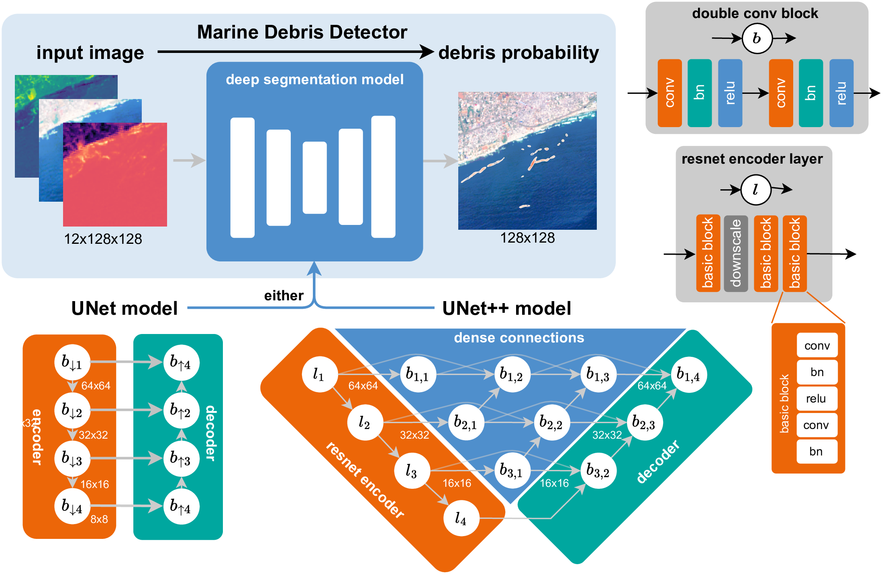

# Pre-trained Models



model training details available in https://wandb.ai/marccoru/marinedebrisdetector
we trained with three random seeds

## Unet

### Links

| seed | checkpoint | complete run |
| --   |---|---|
| 1    |  https://marinedebrisdetector.s3.eu-central-1.amazonaws.com/checkpoints/unet1/epoch=33-val_loss=0.59-auroc=0.985.ckpt |  https://marinedebrisdetector.s3.eu-central-1.amazonaws.com/models/unet1.zip |
| 2    |  https://marinedebrisdetector.s3.eu-central-1.amazonaws.com/checkpoints/unet2/epoch=97-val_loss=0.63-auroc=0.982.ckpt |  https://marinedebrisdetector.s3.eu-central-1.amazonaws.com/models/unet2.zip |
| 3    |  https://marinedebrisdetector.s3.eu-central-1.amazonaws.com/checkpoints/unet3/epoch=73-val_loss=0.60-auroc=0.984.ckpt |  https://marinedebrisdetector.s3.eu-central-1.amazonaws.com/models/unet3.zip |

### Torch Hub

```python
import torch
torch.hub.load("marccoru/marinedebrisdetector", "unet", seed=1)
torch.hub.load("marccoru/marinedebrisdetector", "unet", seed=2)
torch.hub.load("marccoru/marinedebrisdetector", "unet", seed=3)
```

## Unet++

| seed | checkpoint | complete run |
| --   |---|---|
| 1    |  https://marinedebrisdetector.s3.eu-central-1.amazonaws.com/checkpoints/unet%2B%2B1/epoch=54-val_loss=0.50-auroc=0.987.ckpt |  https://marinedebrisdetector.s3.eu-central-1.amazonaws.com/models/unet%2B%2B1.zip |
| 2    |  https://marinedebrisdetector.s3.eu-central-1.amazonaws.com/checkpoints/unet%2B%2B2/epoch=95-val_loss=0.65-auroc=0.988.ckpt |  https://marinedebrisdetector.s3.eu-central-1.amazonaws.com/models/unet%2B%2B2.zip |
| 3    |  https://marinedebrisdetector.s3.eu-central-1.amazonaws.com/checkpoints/unet%2B%2B3/epoch=50-val_loss=0.63-auroc=0.987.ckpt |  https://marinedebrisdetector.s3.eu-central-1.amazonaws.com/models/unet%2B%2B3.zip |

### Torch Hub

```python
import torch
torch.hub.load("marccoru/marinedebrisdetector", "unetpp", seed=1)
torch.hub.load("marccoru/marinedebrisdetector", "unetpp", seed=2)
torch.hub.load("marccoru/marinedebrisdetector", "unetpp", seed=3)
```

## Unet++ without no label refinement

| seed | checkpoint | complete run |
| --   |---|---|
| 1    |  https://marinedebrisdetector.s3.eu-central-1.amazonaws.com/checkpoints/unet%2B%2B1_no_label_refinement/epoch=95-val_loss=0.63-auroc=0.986.ckpt |  https://marinedebrisdetector.s3.eu-central-1.amazonaws.com/models/unet%2B%2B1_no_label_refinement.zip |
| 2    |  https://marinedebrisdetector.s3.eu-central-1.amazonaws.com/checkpoints/unet%2B%2B2_no_label_refinement/epoch=82-val_loss=0.65-auroc=0.985.ckpt |  https://marinedebrisdetector.s3.eu-central-1.amazonaws.com/models/unet%2B%2B2_no_label_refinement.zip |
| 3    |  https://marinedebrisdetector.s3.eu-central-1.amazonaws.com/checkpoints/unet%2B%2B3_no_label_refinement/epoch=97-val_loss=0.64-auroc=0.990.ckpt |  https://marinedebrisdetector.s3.eu-central-1.amazonaws.com/models/unet%2B%2B3_no_label_refinement.zip |

```python
import torch
torch.hub.load("marccoru/marinedebrisdetector", "unetpp", seed=1)
torch.hub.load("marccoru/marinedebrisdetector", "unetpp", seed=2)
torch.hub.load("marccoru/marinedebrisdetector", "unetpp", seed=3)
```

## Models used for qualitative experiments in the paper

### Qualitative experiment durban
https://marinedebrisdetector.s3.eu-central-1.amazonaws.com/models/unet%2B%2B_durban.zip
model checkpoint here:
https://s3.console.aws.amazon.com/s3/object/marinedebrisdetector?region=eu-central-1&prefix=models/unet%2B%2B_durban.ckpt

same model is used for 12-band PlanetScope comparison in PLP2022 and Accra
Four-channel model available here:
https://marinedebrisdetector.s3.eu-central-1.amazonaws.com/models/unetpp_hrbands.ckpt

