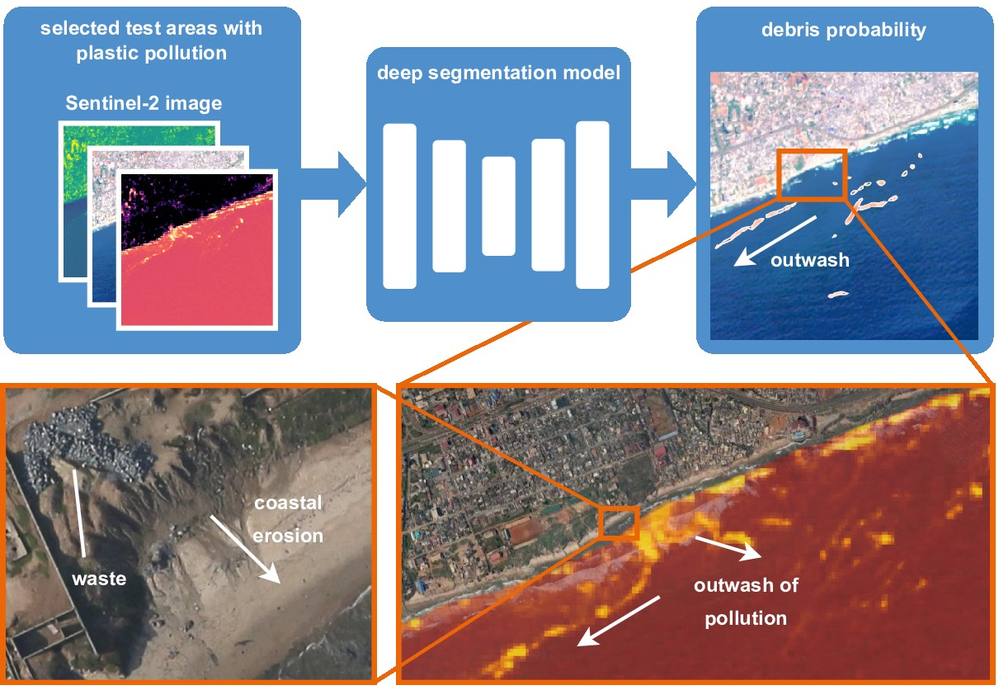

# Detection of Marine Debris with Sentinel-2

> Rußwurm, M., Venkatesa, S. J., & Tuia, D. (2023). Large-scale detection of marine debris in coastal areas with Sentinel-2. Iscience, 26(12).


**_NOTE:_**  The costs of hosting the data and models got too high. I had to set it private. Please contact Marc Russwurm per email if you would like to have access to the data and model weights.
For now, you can find the model weights in [this Google Drives folder](https://drive.google.com/drive/folders/1OBKr9G4zCP3X7fa8C7xBpJ8WNUyiajDL?usp=drive_link)



## Getting Started

We provide a python package for easy installation and model predictions

Installation of the Python Package
```
pip install marinedebrisdetector

# alternative from GitHub directly
pip install git+https://github.com/marccoru/marinedebrisdetector
```

You now have a `marinedebrisdetector` program to make predictions of Sentinel-2 tif images on the console.
Check `marindebrisdetector --help` for information on parameters and options.

Predict the qualitative test images from the paper with this command.
```
marinedebrisdetector --plot-qualitative
```

predict a Sentinel-2 scene (Durban) with these commands
```
# download example scene (~300 MB) to ("durban_20190424.tif")
marinedebrisdetector --download-durban

# predict the durban example scene
marinedebrisdetector durban_20190424.tif
```
the prediction should be in the same folder named `durban_20190424_prediction.tif`. You can inspect the prediction scene in any image viewer, 
but best in a GIS program [QGIS](https://qgis.org/en/site/) or [ArcGIS](https://www.arcgis.com/home/index.html) that allows you inspect and overlay other georeferenced data.

The tested prediction times of the scene prediction above are:
* 11 sec on NVIDIA GeForce RTX 3090
* 15 sec on NVIDIA GeForce GTX 970
* 11 minutes on Macbook Pro CPU

### Pre-trained Models

We provide pre-trained weights for 12-channel Sentinel-2 imagery.
A detailed list of weights can be found on the [models page](doc/models.md)

pretrained segmentation models can be loaded via the torch hub in python
```python
import torch

torch.hub.load("marccoru/marinedebrisdetector", "unetpp")
torch.hub.load("marccoru/marinedebrisdetector", "unet")

# trained without label refinement (can lead to thinner more fine-grained predictions)
torch.hub.load("marccoru/marinedebrisdetector", "unetpp", label_refinement=False)
```

The `marinedebrisdetector` defaults to the `unetpp/unet++`.

### Datasets

We trained the underlying [Unet++ segmentation model](https://arxiv.org/abs/1807.10165) (implementation from [Pytorch Segmentation Models](https://github.com/qubvel/segmentation_models.pytorch)) on an aggregated a combination of existing datasets for training [FloatingObjects Dataset (Mifdal et al., 2020)](https://github.com/ESA-PhiLab/floatingobjects), [Marine Debris Archive (Kikaki et al., 2022)](https://marine-debris.github.io/), [S2Ships (Ciocarlan et al., 2021)](https://github.com/alina2204/contrastive_SSL_ship_detection),
and newly annotated a refinedFloatingObjects dataset and Sentinel-2 images of the [Plastic Litter Projects (Papageorgiou et al., 2022; under review)](https://plp.aegean.gr/)

More details in a dedicated [data page](doc/data.md). 
Executing the training script ([see this "model training" page](doc/model_training.md)) with `--download` will automatically download and uncompress the required datasets (116 GB (uncompressed)).

### Model Training

We provide a [a training script](marinedebrisdetector/train.py) powered by [Pytorch Lightning](https://www.pytorchlightning.ai/) and [Weights and Biases](https://wandb.ai/site) to train new models and reproduce our results.
More details on training commands and ablations in a dedicated page for [model training](doc/model_training.md)

### Random Forest Comparisons

We compare to a random forest trained on 1) the original MARIDA dataset ([Kikaki et al., 2022](https://journals.plos.org/plosone/article?id=10.1371/journal.pone.0262247)) and 2) a random forest trained on our dataset.
You should be able to reproduce the results in these scripts. The required data and random forest classifier is downloaded automatically.
```
python comparisons/test_rf_original_data.py
python comparisons/test_rf_our_data.py
```
