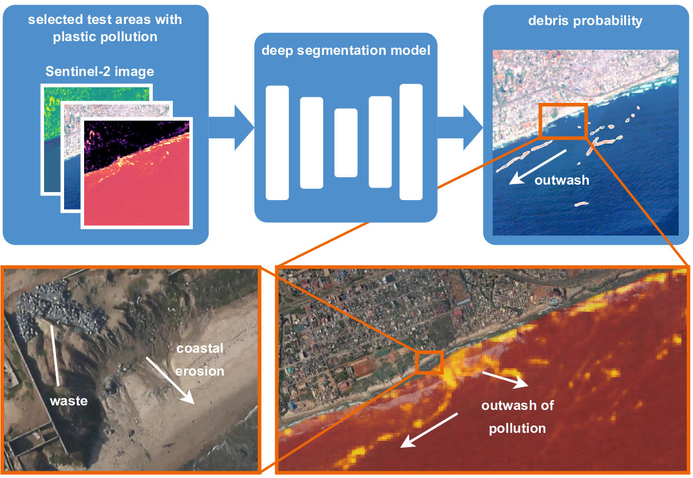

# Marine Debris Detector



## Setup 

### Python Environment
```
python3 -m venv venv
source venv/bin/activate
pip install -r requirements.txt
```

### Data

more details in a dedicated [data page](doc/data.md)

```
python download_data.py
```

### Models

more details in a dedicated [models page](doc/models.md)

```
python download_models.py
```

### Test

#### our Marine Debris Detector
```
python test.py --ckpt-folder /data/marinedebris/results/ours/unet++_2022-10-21-1e6
```

#### Mifdal et al., 2021
```
python test.py --comparison mifdal --ckpt-folder /data/marinedebris/results/mifdal/unet-posweight1-lr001-bs160-ep50-aug1-seed0
```

#### Kikaki et al., 2022
```
python test_kikaki.py --ckpt-folder /data/marinedebris/results/kikaki/randomforest
```

